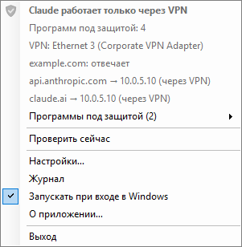
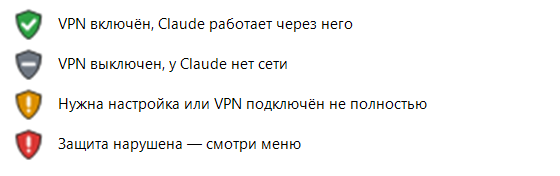
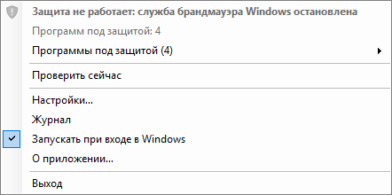
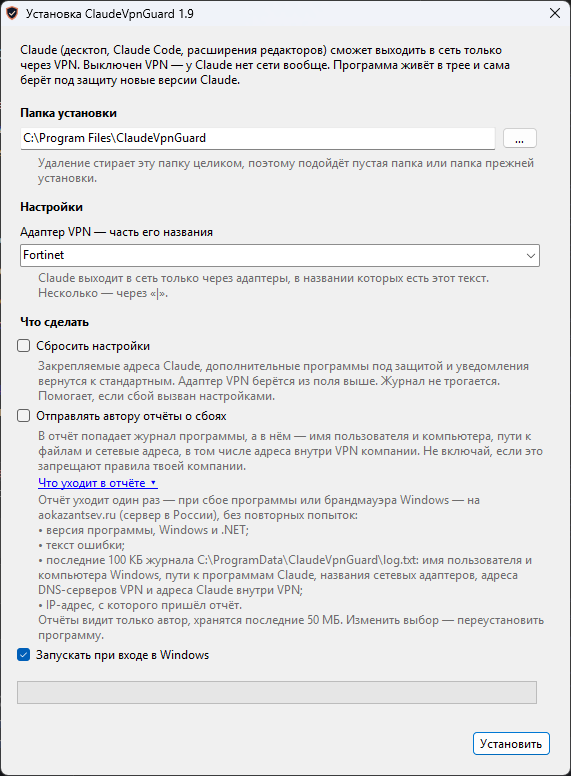
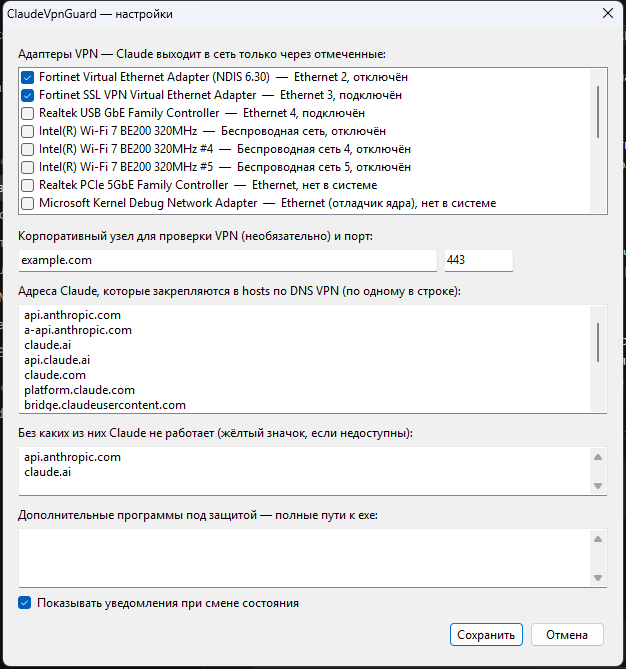

# ClaudeVpnGuard

Claude выходит в сеть **только через корпоративный VPN**. Выключен VPN — у Claude нет сети вообще,
никаких «пошёл напрямую». Значок-щит в трее показывает, всё ли в порядке.

**Актуальная версия** — на странице [Releases](../../releases/latest), что изменилось — в [истории версий](CHANGELOG.md).



Под защиту попадают десктопное приложение Claude, Claude Code (CLI), Claude Code из расширений
VS Code / Cursor / Windsurf и мост Claude in Chrome. Новые версии Claude, которые ставятся
автообновлением, берутся под защиту сами, в течение секунды после появления.

## Значок



Наведи на значок — подсказка скажет, что происходит. Правая кнопка — подробности: какой адаптер VPN,
отвечает ли Claude через VPN, через какой адрес он идёт, какие программы под защитой.
При смене состояния приходит уведомление.

## Как это работает

1. **Брандмауэр Windows.** На каждый exe Claude ставится правило «запретить исходящие» на всех
   сетевых адаптерах, кроме адаптера VPN. VPN выключен — адаптер без маршрутов, сети нет. Новый
   адаптер (Wi-Fi, раздача с телефона) попадает в правила сразу, как появляется.
2. **Файл hosts.** Адреса Claude (`api.anthropic.com`, `claude.ai` и другие) закрепляются за тем
   адресом, который отдаёт DNS внутри VPN. Без VPN имена Claude не уходят даже в DNS провайдера.
   Если DNS VPN имя не знает — оно закрепляется за `0.0.0.0`.
3. **Проверка доступа к Claude через VPN.** См. раздел ниже: VPN подключён, но Claude через него
   не отвечает — у Claude отключается сеть целиком.
4. **Сторож.** Раз в 5 секунд и на каждое изменение сети программа сверяет правила с найденными exe,
   восстанавливает правила и hosts, если их кто-то поменял, и проверяет соединения Claude: соединение
   мимо VPN закрывается, повторилось — значок краснеет.

## Проверка доступа к Claude через VPN

Адаптер VPN может считаться подключённым, когда туннель уже не работает: клиент VPN переподключается,
сервер отвалился, внутри VPN пропал маршрут. Поэтому программа сама проверяет, отвечает ли Claude через
VPN, и пускает его в сеть только после успешной проверки.

- **Что проверяется.** TCP-соединение с `api.anthropic.com:443` по адресу, который отдал DNS внутри
  VPN и который закреплён в hosts. Отдельного запроса к DNS нет.
- **Проверка сама не уходит мимо VPN.** Перед соединением программа сверяет таблицу маршрутов: путь к
  адресу должен идти через адаптер VPN. Соединение открывается с адреса адаптера VPN, поэтому Windows
  не выпустит его через другой адаптер. Путь мимо VPN — соединение не открывается вовсе.
- **Как часто.** Пока всё в порядке — раз в 30 секунд. Пока проверка не прошла — раз в 5 секунд.
  Выключение VPN видно сразу, без ожидания проверки.
- **Что происходит при сбое.** У Claude отключается сеть целиком, включая адаптер VPN, пока проверка
  снова не пройдёт:

| Результат | Значок | Сеть у Claude |
|---|---|---|
| Claude отвечает через VPN | зелёный «Claude работает только через VPN» | только через VPN |
| Ещё не проверено (запуск, VPN только подключился) | серый «Проверяю доступ к Claude через VPN…» | нет |
| Claude не отвечает через VPN | жёлтый «Claude не отвечает через VPN — сеть Claude отключена» | нет |
| Путь к Claude идёт мимо VPN | красный «Путь к Claude идёт мимо VPN — сеть Claude отключена» | нет |

Если серверы Anthropic лежат, значок тоже станет жёлтым: Claude в этот момент действительно не
работает, VPN тут ни при чём.

Защита не зависит от того, запущена ли программа: правила и hosts живут в Windows. Программа нужна,
чтобы брать под защиту новые версии Claude и показывать состояние.

## Чего программа не делает

- **Не трогает дочерние процессы Claude.** `git`, `curl`, Gradle, MCP-серверы на `node`/`python`,
  которые Claude запускает, ходят в сеть как обычно: брандмауэр не умеет фильтровать по дереву
  процессов.
- **Не пропускает то, что VPN не проксирует.** Если корпоративный DNS не подменяет какой-то адрес
  Claude (телеметрия, `bridge.claudeusercontent.com`, сайты для WebFetch, удалённые MCP-серверы),
  Claude до него не достучится — это и есть «только через VPN».
- **Закрепление в hosts действует на весь компьютер.** `claude.ai` в браузере без VPN тоже не откроется.
- **Защищает одного пользователя Windows** — того, под кем установлена.
- **Не работает, если групповая политика запрещает локальные правила брандмауэра.** Значок покажет это
  красным.
- **Не работает без брандмауэра Windows.** Выключен брандмауэр или остановлена его служба — значок
  красный и называет причину, установщик предупреждает об этом заранее. Включи брандмауэр —
  программа подхватит его сама, перезагрузка не нужна.

  

## Установка

1. Скачай `ClaudeVpnGuardSetup.exe` со страницы [последней версии](../../releases/latest).
2. Запусти и подтверди окно UAC: программа правит брандмауэр и hosts, поэтому нужны права
   администратора.
3. Проверь папку установки (по умолчанию `C:\Program Files\ClaudeVpnGuard`) и заполни настройки:
   - **адаптер VPN** — часть названия адаптера из «Панель управления → Сетевые подключения»
     (колонка «Имя устройства»), в списке — адаптеры этого компьютера. По умолчанию `Fortinet`.
4. Нажми «Установить». Программа запустится, в трее появится значок-щит (в Windows 11 он может
   оказаться среди скрытых значков, под стрелкой ^). Перезагрузка не нужна: защита действует сразу.

Если брандмауэр Windows выключен, установщик скажет об этом в начале окна. Установить можно и так,
но защита заработает только после включения брандмауэра.



При переустановке поля заполняются текущими настройками.

Настройки и журнал лежат в `C:\ProgramData\ClaudeVpnGuard` — менять их может только
администратор. Автозапуск — задача Планировщика заданий с наивысшими правами, без окна UAC при входе.

## Включение и отключение защиты

Трей → **«Включить защиту»** / **«Выключить защиту»** — кнопка переключает состояние на лету.

**Когда отключать:**
- Авторизация в Claude Desktop не работает: корпоративный прокси блокирует OAuth-эндпоинты
  Anthropic. Выключите защиту, авторизуйтесь, затем включите обратно.
- При отключении: все правила брандмауэра снимаются и блок в hosts очищается. Claude получает
  доступ в сеть без ограничений до конца сеанса Windows.
- Значок показывает серый статус «Защита отключена» вместо проверки состояния.

## Настройки

Трей → «Настройки…» — то же, что в установщике, плюс список закрепляемых имён, дополнительные
программы под защиту и переключатель защиты.



| Ключ в `settings.txt` | Что это | По умолчанию |
|---|---|---|
| `vpnAdapters` | части названия адаптеров VPN, через `\|` | `Fortinet` (из установщика) |
| `pinnedHosts` | имена, которые закрепляются в hosts | адреса Anthropic и Claude |
| `criticalHosts` | без каких имён Claude не работает; нет адреса через VPN — жёлтый значок | `api.anthropic.com`, `claude.ai` |
| `extraExecutables` | дополнительные exe под защиту | пусто |
| `notifications` | уведомления при смене состояния (`1`/`0`) | `1` |
| `protectionEnabled` | защита включена (`1`/`0`) | `1` |

## Если что-то не так

- **Журнал программы** — трей → «Журнал» или `C:\ProgramData\ClaudeVpnGuard\log.txt`. В нём шаги
  запуска, найденные адаптеры и программы Claude, а при падении — текст ошибки.
- **Журнал установки** — `%TEMP%\ClaudeVpnGuard-setup.log`.
- **Настройки** — `C:\ProgramData\ClaudeVpnGuard\settings.txt` или трей → «Настройки…».
  `ClaudeVpnGuard.exe.config` рядом с программой — служебный файл .NET, настроек в нём нет.

## Отчёты о сбоях

В установщике есть галочка «Отправлять автору отчёты о сбоях», по умолчанию она **выключена**.
Включай её, только если правила твоей компании это допускают: в отчёт попадает журнал программы.

- **Что уходит.** Версия программы, Windows и .NET, текст ошибки, последние 100 КБ журнала
  `C:\ProgramData\ClaudeVpnGuard\log.txt` — в нём имя пользователя и компьютера Windows, пути к
  программам Claude, названия сетевых адаптеров, адреса DNS-серверов VPN и адреса Claude внутри VPN.
  Сервер записывает IP-адрес, с которого пришёл отчёт.
- **При каких сбоях.** Программа упала или работа с брандмауэром Windows упала либо зависла.
- **Куда.** `https://aokazantsev.ru/pets/claudevpnguard/crash-report`, сервер в России. Отчёты видит только автор,
  хранятся последние 50 МБ — при поступлении новых самые старые удаляются. Подробности — в
  [политике обработки данных](https://aokazantsev.ru/privacy).
- **Когда.** Один раз при сбое, без повторных попыток. Не ушло — в журнал пишется «отчёт о сбое не
  отправлен» с причиной.
- **Как изменить выбор.** Переустановить программу с галочкой или без неё. Деинсталлятор удаляет
  согласие вместе с остальными данными.

## Обновление

Трей → «Проверить обновление…». Есть версия новее — установщик скачивается в «Загрузки» и
открывается в Проводнике; путь к нему и кнопка «Открыть папку» остаются в окне. Запусти его — новая
версия встанет поверх текущей, удалять старую не нужно, настройки сохранятся. Если сбой вызван
настройками, в установщике есть галочка «Сбросить настройки».

## Удаление

«Параметры → Приложения → ClaudeVpnGuard → Удалить» или `Uninstall.exe` в папке программы.
Программа закрывается сама; снимаются правила брандмауэра (группа `ClaudeVpnGuard`) и блок в
hosts, удаляются программа, настройки, журнал, автозапуск и запись в «Приложениях». «Выход» в
меню трея защиту **не** снимает.

## Сборка

Нужен только Windows: штатный `csc.exe` .NET Framework 4.8, без SDK и NuGet.

```
build.cmd             программа → ClaudeVpnGuard.exe
build-installer.cmd   программа, деинсталлятор и установщик → dist\ClaudeVpnGuardSetup.exe
```

## Лицензия

MIT — см. [LICENSE](LICENSE).
